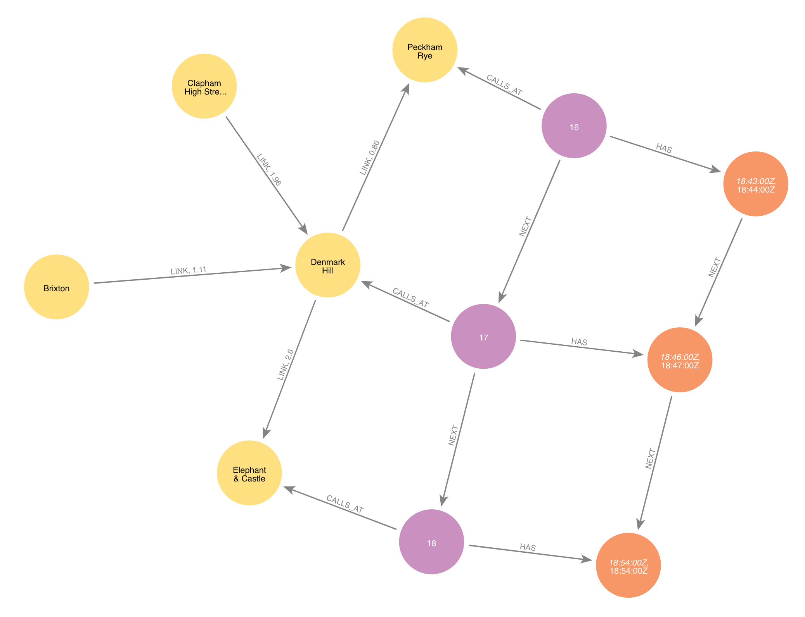

# UK Railway Graph

UK railway data extracted from publicly available datasets (see [Rail Delivery Group page](https://www.raildeliverygroup.com/our-services/rail-data/fares-timetable-data.html)). It works as a good dataset for learning how Cypher's [quantified path patterns](https://neo4j.com/docs/cypher-manual/current/patterns/concepts/#quantified-path-patterns) work.



# How to load the dataset

Run the Cypher in `cypher/import.cypher` against your Neo4j instance using Browser (you will need to remove the `:auto` commands if you want to run in cypher-shell). Note that the node and relationship counts will exceed the Aura free tier allowances.

Try it out with a query like this one:

```cypher
MATCH (dmk:Station {name: 'Denmark Hill'})<-[:CALLS_AT]-(l1a:CallingPoint)
        (()-[:NEXT]->(n) 
          WHERE NOT EXISTS { (n)-[:CALLS_AT]->(:Station:LondonGroup) })+
        (l1b)-[:CALLS_AT]->(x:Station)<-[:CALLS_AT]-(l2a:CallingPoint)
        (()-[:NEXT]->(m)
          WHERE NOT EXISTS { (m)-[:CALLS_AT]->(:Station:LondonGroup) })+
        (l2b)-[:CALLS_AT]->(gtw:Station {name: 'Gatwick Airport'})
MATCH (l1a)-[:HAS]->(s1:Stop)-[:NEXT]->+(s2)<-[:HAS]-(l1b)
        WHERE time('09:30') < s1.departs < time('10:00')
MATCH (l2a)-[:HAS]->(s3:Stop)-[:NEXT]->+(s4)<-[:HAS]-(l2b)
        WHERE s2.arrives < s3.departs < s2.arrives + duration('PT15M')
RETURN s1.departs AS leg1Departs, s2.arrives AS leg1Arrives, x.name AS changeAt,
        s3.departs AS leg2Departs, s4.arrives AS leg2Arrive,
        duration.between(s1.departs, s4.arrives).minutes AS journeyTime
ORDER BY leg2Arrive LIMIT 5
```

All being well, it should return the following results:

```
╒═══════════╤═══════════╤══════════════════╤═══════════╤═══════════╤═══════════╕
│leg1Departs│leg1Arrives│changeAt          │leg2Departs│leg2Arrive │journeyTime│
╞═══════════╪═══════════╪══════════════════╪═══════════╪═══════════╪═══════════╡
│"09:37:00Z"│"09:50:00Z"│"Clapham Junction"│"09:53:00Z"│"10:19:00Z"│42         │
├───────────┼───────────┼──────────────────┼───────────┼───────────┼───────────┤
│"09:37:00Z"│"09:50:00Z"│"Clapham Junction"│"10:01:00Z"│"10:25:00Z"│48         │
├───────────┼───────────┼──────────────────┼───────────┼───────────┼───────────┤
│"09:52:00Z"│"10:05:00Z"│"Clapham Junction"│"10:12:00Z"│"10:38:00Z"│46         │
└───────────┴───────────┴──────────────────┴───────────┴───────────┴───────────┘
```
